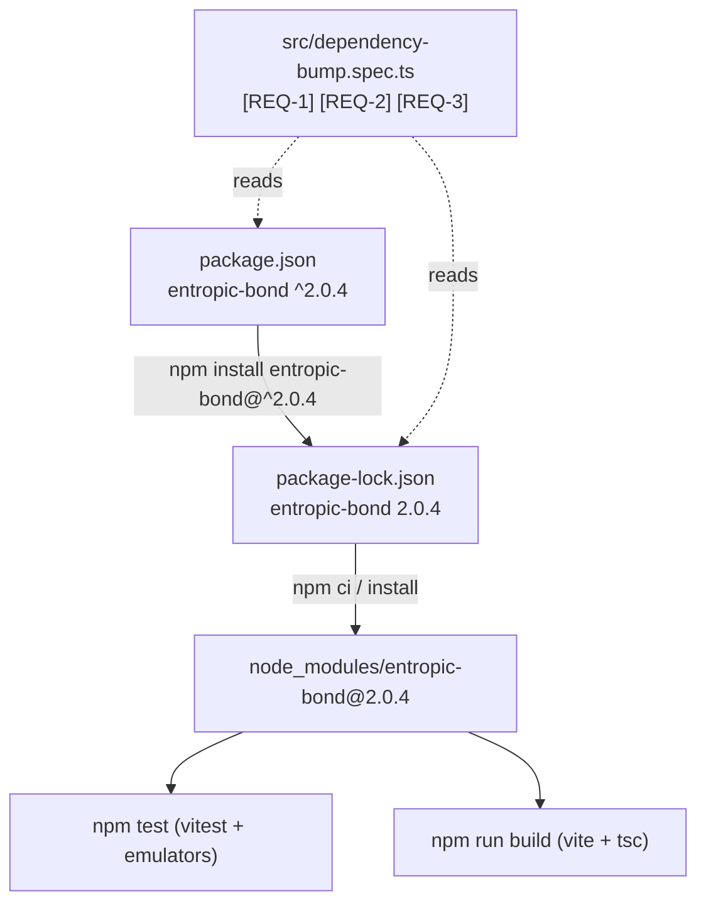

# Design — Bump entropic-bond to 2.0.4 (bump-eb-firebase-admin)

## Abstract

The project declares `"entropic-bond": "^2.0.0"` while the latest published
v2.x release is `2.0.4`. The bump touches only dependency metadata: the
manifest range becomes `^2.0.4` and the lockfile resolves `2.0.4`. A small
manifest guard spec reads `package.json` / `package-lock.json` and pins the
bumped range, the locked version and every other dependency range so the
constraint "do not bump any other dependency" stays enforced.

## Plan

1. Write `src/dependency-bump.spec.ts` covering `[REQ-1]`, `[REQ-2]`, `[REQ-3]`
   (RED: range `^2.0.0`, locked `2.0.0`).
2. Run `npm install entropic-bond@^2.0.4` so the manifest saves the caret range
   and the lockfile resolves `2.0.4` (GREEN for the guard spec).
3. Review the diff: only `entropic-bond` entries in `package.json` and
   `package-lock.json` may change (`[REQ-3]`).
4. Run the full suite `[REQ-4]` and the build `[REQ-5]`.

## Changes

- `package.json`: `dependencies.entropic-bond` `^2.0.0` → `^2.0.4`.
- `package-lock.json`: `entropic-bond` range + resolved/integrity for `2.0.4`.
- `src/dependency-bump.spec.ts`: new manifest guard spec (no runtime code).

No runtime source change: `2.0.1`–`2.0.4` are upstream fixes (initial
collection snapshot, `onDocumentChange` deletions, cursor delay, cached-props
fan-out) consumed transparently through the existing seams; the existing suite
proves compatibility.

## Best practices

- Test the observable artifacts (manifest/lockfile) rather than process steps.
- Frozen baseline ranges in the guard spec encode the "no other bump"
  constraint without shelling out to git.
- Minimal, non-invasive change; existing modules untouched.

## Strengths / weaknesses

- Strength: tiny surface, every `[REQ-n]` traces to an automated check or a
  verifiable command run.
- Weakness: the guard spec re-states dependency ranges as constants, so a
  legitimate future bump of another dependency must update the baseline —
  intentional friction that makes the change explicit.

## Audit note (code-auditor, Step 2 stop)

Objective review against the feature file found no architectural friction: the
change is metadata-only, the diff is confined to the `entropic-bond` entries in
`package.json`/`package-lock.json`, and the build already externalizes
`^entropic-bond`, so no module or seam is affected. Less-valuable improvements
considered and not taken: (a) deriving the `[REQ-3]` baseline from the git
parent instead of freezing ranges in the spec — rejected because it couples a
unit test to VCS state; (b) asserting the full lockfile snapshot — rejected as
brittle churn for a 1-package bump. Recommendation strength: **Speculative**
for both; nothing outstanding.
