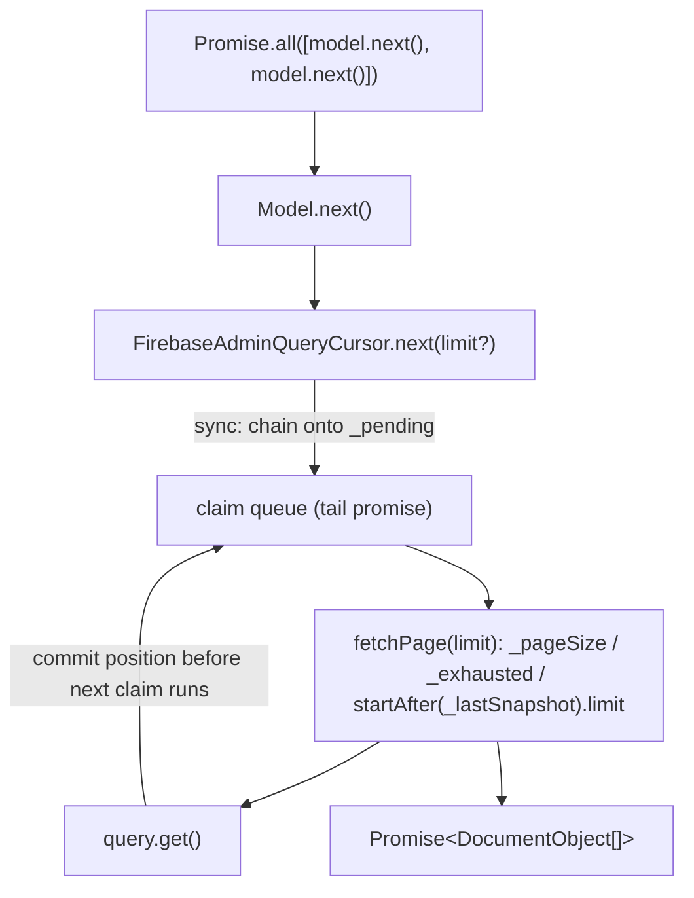

# Design — Concurrency-safe FirebaseAdminQueryCursor (cursor-concurrency)

## Abstract

`FirebaseAdminQueryCursor.next()` currently reads `_lastSnapshot` / `_exhausted`,
awaits `query.get()`, and only **after** the await writes the new position.
Overlapping `next()` calls therefore start from the same snapshot: they fetch
the same page (duplicates) while the position advances once (later pages
repeated or skipped); `_exhausted` has the same read-then-write race and a
concurrent `limit` is applied against a stale position.

Fix: claim each page **synchronously at call time** by chaining the page fetch
onto the previous claim's completion (tail-promise chain / mutex). The queued
claim runs only after the prior page has been fetched and the position
committed, so its query is always built from the position it claimed.

## Requirements

- [REQ-1](file://specs/cursor-concurrency/cursor-concurrency.feature) — Overlapping `next()` calls receive consecutive pages (each call advances the cursor exactly once, no duplicates, no gaps, regardless of resolution order).
- [REQ-2] — Concurrent `next()` calls past the end of the result set all resolve to empty pages.
- [REQ-3] — An overlapping `next()` call sizes its own page with its `limit` argument (decided at claim time against the claimed position).
- [REQ-4] — Each `next()` call retrieves at most one page from the server (server-side `startAfter(lastSnapshot) + limit(pageSize)`; no eager materialization; all state stays on the cursor).

## Design choice: tail-promise chain (mutex) vs synchronous claim token

- **Tail-promise chain (chosen)**: `next()` synchronously composes
  `claim = _pending.then(() => fetchPage(limit))` and stores the claim (or its
  settled shadow) back into `_pending` before returning. Ordering of pages
  equals ordering of `next()` calls; `_lastSnapshot` / `_exhausted` are read and
  written only inside a claim, never across an await window shared with another
  caller.
- **Claim token (rejected)**: a token/flag marked before the await can reserve
  a slot, but an overlapping caller still cannot build its query until the
  previous claim resolves its snapshot — so it must ultimately wait on the same
  chain. The token design degenerates into the chain with extra state.

A rejected page fetch settles only that claim; the chain stores a
resilient shadow (`then(_, _)`) so later `next()` calls still run instead of
inheriting a permanently rejected tail (preserves the pre-fix independence of
calls on failure).

## Seams

## Plan

1. Failing tests: concurrent `next()` pages, concurrent-past-end, per-call
   `limit`, at-most-one-page (REQ-1..REQ-4) in `src/store/firebase-admin-datasource.spec.ts`.
2. Implement the tail-promise claim in `FirebaseAdminQueryCursor.next()`.
3. Emulator suite green, `npm run build` typechecks.
4. Code audit against `codebase-design` (audit note appended below).

## Test ↔ requirement correlation

- [REQ-1] `src/store/firebase-admin-datasource.spec.ts` — "Overlapping next calls receive consecutive pages. [REQ-1]" plus a boundary-crossing supplementary case.
- [REQ-2] "Concurrent next calls past the end of the result set all resolve to empty pages. [REQ-2]"
- [REQ-3] "An overlapping next call sizes its own page with its limit argument. [REQ-3]"
- [REQ-4] "Each next call retrieves at most one page from the server. [REQ-4]"

## Audit note (code-auditor)

Audited `src/store/firebase-admin-datasource.ts` against `codebase-design` using
only the feature file and the modified source (design doc and test narrative
were not read as input). No major improvements required; no refactoring made.

- **Depth**: the interface stayed a single method — `next( limit? )` now hides
  base query, page size, last snapshot, exhaustion *and* claim ordering. The
  deletion test passes: removing the cursor would scatter `startAfter`/`limit`,
  snapshot bookkeeping and the claim queue back into `find()` and every caller.
  The fix deepened the module without growing its interface.
- **Seam**: `DataSource.find()` returns a `QueryCursor` — a real seam (core
  `JsonDataSource` and this adapter both sit at it) and the value the caller
  owns keeps the claim queue per query, not on the datasource.
- **Interface is the test surface**: the regression tests cross the same
  `Model.next()` / `QueryCursor.next()` seam consumers use; no private field
  (`_pending`, `_lastSnapshot`, `_exhausted`) is asserted.
- **Locality**: all serialization reasoning lives in `next()`; the split
  `fetchPage()` keeps "claim in call order" and "execute one page" readable in
  one place each.

Less valuable, intentionally not changed:

- `FirebaseAdminQueryCursor extends QueryCursor` still seeds the parent with
  `[]`, so inherited `_docs`/`_position`/`_limit` are dead state (pre-existing;
  composition would force a nominal cast at the seam).
- A full page is only discovered to be the last on the following `next()` call
  (pre-existing; a `limit( pageSize + 1 )` probe would add a round trip).
- The claim tail stores an explicit no-op settle pair
  (`claim.then( () => undefined, () => undefined )`); a `finally`-style helper
  would be equivalent, not clearer.
