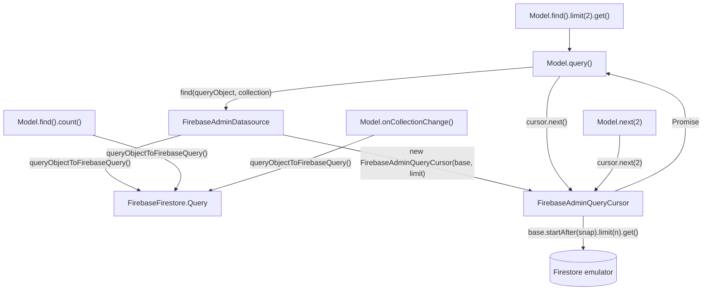
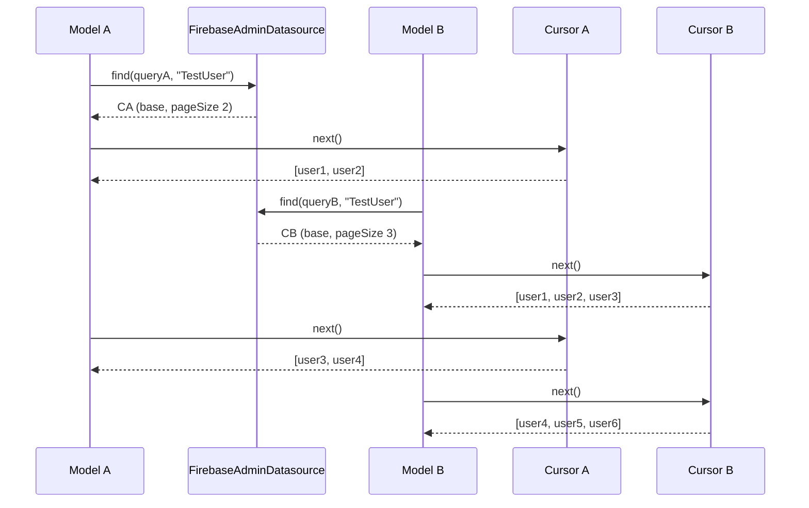

# Design — Migrate FirebaseAdminDatasource to the 2.0.0 QueryCursor API (gh-issue-2)

## Abstract

Core `entropic-bond@2.0.0` moved pagination state off the data source and into a
per-query `QueryCursor` returned by `find()`. This change adapts
`FirebaseAdminDatasource` to that seam:

- `find()` returns a `FirebaseAdminQueryCursor` instead of an array.
- The cursor is a small, deep module that owns the base `FirebaseFirestore.Query`,
  the page size and the last `QueryDocumentSnapshot`; `next( limit? )` runs
  `startAfter( lastSnapshot ) + limit( pageSize )` server-side.
- `next()` on the adapter, `getFromQuery()` and the `_lastQuery`, `_lastLimit`,
  `_lastDocRetrieved` fields are deleted. No pagination state remains on the
  adapter.

`count()` and `onCollectionChange()` keep using `queryObjectToFirebaseQuery()`;
that helper no longer writes `_lastLimit` nor applies `queryObject.limit` to the
query it returns, because the page size now belongs to the cursor.

## Seams

## Plan

1. Add failing `Data Cursors` interleaving tests (REQ-2, REQ-3, REQ-5).
2. Add `FirebaseAdminQueryCursor extends QueryCursor` in `firebase-admin-datasource.ts`.
3. Change `find()` to build the base query and return the cursor; delete
   `next()`, `getFromQuery()` and the shared fields.
4. Drop the `_lastLimit` write and the `query.limit()` call from
   `queryObjectToFirebaseQuery()`.
5. Run the emulator suite, refactor, build.

## Proposed changes

- `src/store/firebase-admin-datasource.ts` — new `FirebaseAdminQueryCursor`;
  `find()` returns it; remove adapter pagination state and `next()`.
- `src/store/firebase-admin-datasource.spec.ts` — interleaving and
  count-between-pages tests.
- `package.json` / lockfile — `entropic-bond@^2.0.0`.

## Best practices taken

- **Locality**: all `startAfter`/`limit` arithmetic lives in one cursor class.
- **Depth**: `next( limit? )` hides the base query, page size and last snapshot.
- **Interface as test surface**: tests cross the same `Model` seam consumer use.
- **Minimum change**: `count()` and `onCollectionChange()` keep their paths.

## Strengths and weaknesses

- Interleaved queries are isolated per cursor; no cross-query or cross-collection
  clobbering.
- Server-side pagination is preserved: no eager materialization of the result set.
- Breaking change for consumers that subclass the datasource or call
  `datasource.next()`; they must hold the `QueryCursor` from `find()`.
- The cursor reuses the parent `QueryCursor` type but ignores its in-memory
  `docs`/`position`; those fields stay empty by construction.
- `queryObjectToFirebaseQuery()` no longer applies `queryObject.limit`, so
  `count()` counts every match and `onCollectionChange()` observes the whole
  collection even when a limit is set. This is the intended behaviour: the page
  size belongs to the cursor, not to the aggregate/live-query paths. No test
  relied on the previous limited behaviour.

## Audit note (code-auditor)

Audited the implementation against `codebase-design` using only the feature file
and the source (no test or design narrative). No major improvements required.

- **Depth**: `FirebaseAdminQueryCursor.next( limit? )` hides the base query, page
  size, last snapshot and exhaustion behind one method; the deletion test passes
  (deleting it would scatter `startAfter`/`limit`/snapshot bookkeeping back into
  `find()` and callers).
- **Seam**: `DataSource.find()` is a real seam (core `JsonDataSource` and this
  adapter both sit at it) and returns a value the caller owns, which is what
  removes the shared state.
- **Interface is the test surface**: tests cross the same `Model`/`QueryCursor`
  seam consumers use; no private field is asserted.

Less valuable, intentionally not changed:

- `FirebaseAdminQueryCursor extends QueryCursor` but seeds the parent with `[]`,
  so the inherited `_docs`/`_position`/`_limit` are unused. Composition would
  avoid the dead state, but `QueryCursor` is a concrete class, so composition
  would force a nominal cast at the seam; inheritance keeps the type honest.
- A full page is only discovered to be the last on the following `next()` call.
  A `limit( pageSize + 1 )` probe could report `hasMore` eagerly, but the core
  interface does not expose it and it would add a round trip for every page.
