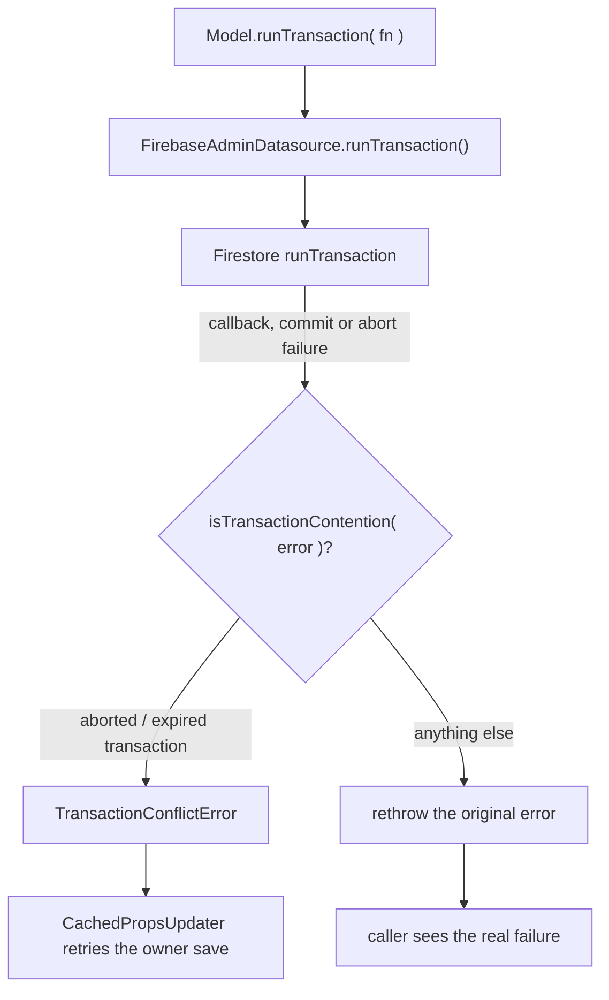

# Design — Transaction failures keep their real cause (transaction-error-masking)

## Abstract

`FirebaseAdminDatasource.runTransaction()` converts **every** failure into
`TransactionConflictError`:

```ts
catch( error ) {
	throw new TransactionConflictError()
}
```

The conversion exists for one case: core `CachedPropsUpdater.updateOwnerDocument`
retries an owner save while `runTransactionalUpdate` sees a
`TransactionConflictError`, which is what makes concurrent cached-prop fan-outs
lost-update safe. Every other failure — an oversized document
(`INVALID_ARGUMENT`), a permission failure, an invalid write, an application
error from the callback — is reported as a conflict too, so:

- the caller retries up to `transactionRetries` times for nothing,
- the real cause never reaches the caller, the function log or the operator,
- and the contract stated in core (`TransactionConflictError` when a document read
  inside the transaction was modified by another writer before commit) is a lie.

Observed in production (SPB `onDocumentChange` fan-out, gh-1355): 975 of 1331
RopaForm owners kept the stale cached name and **no** error appeared in the logs,
because every failure was swallowed into a conflict that the caller retried and
then dropped.

## Requirements

- [REQ-1](file://specs/transaction-error-masking/transaction-error-masking.feature) — A commit failure that cannot succeed on a retry (oversized document, `INVALID_ARGUMENT`) rejects with its own error, not a `TransactionConflictError`.
- [REQ-2] — An error raised by the transaction callback rejects with that same error, not a `TransactionConflictError`.
- [REQ-3] — A transaction aborted by contention (`ABORTED`: status `10`, or `409` as GAXIOS may report it, and the expired-transaction `INVALID_ARGUMENT`) is reported as `TransactionConflictError`.
- [REQ-4] — Any other failure is not a transaction conflict.

## Design choice: classify the failure instead of catching everything

- **Classify the commit failure (chosen)**: keep the buffer-throw and decide what
  the failure means. `isTransactionContention()` lives in its own module
  (`src/store/transaction-error.ts`), is not re-exported from the package entry
  point, and is the single place stating which statuses mean "the transaction
  could not commit because of concurrent modification".
- **Rethrow everything else (chosen)**: untouched, so `code`, `message`,
  `metadata` and the error identity survive for the caller (core rethrows it and
  Cloud Functions logs it).
- **Mirror the SDK's whole retryable set (rejected)**: `UNAVAILABLE`,
  `DEADLINE_EXCEEDED`, `INTERNAL`, `RESOURCE_EXHAUSTED`, `CANCELLED`, `UNKNOWN`
  and `UNAUTHENTICATED` are transport failures, not concurrent modification; the
  Firestore client already retried them internally (`isRetryableTransactionError`
  in `@google-cloud/firestore`) before surfacing them. Reporting them as
  conflicts hides a real problem and turns the caller's retry loop into a
  five-times amplifier of a failing operation. A surfaced transport failure must
  abort the fan-out visibly.
- **Tag callback errors to tell them apart from driver aborts (rejected)**: the
  callback's transaction reads and writes throw driver errors through the same
  scope, so a marker would also swallow genuine aborts raised inside the
  callback. An application error that carries the driver's `ABORTED` code stays
  indistinguishable from an abort; that ambiguity is accepted and documented
  here (see "Known ambiguity").
- **Log inside the adapter (rejected)**: logging is the caller's concern; the
  adapter must not decide that a failure deserves a log line.

## Seams



## Known ambiguity

An error thrown by application code that carries `code = 10` is classified as a
conflict even though the application, not the driver, raised it. The driver uses
the same code for an aborted transaction and the error cannot be attributed by
inspection inside `runTransaction()`; the alternative (tagging errors raised by
the callback) misclassifies the abort raised by a `transaction.get()` that runs
inside that callback, which is the more valuable case.

## Plan

1. Failure first: oversized-commit and callback-error tests in
   `src/store/firebase-admin-datasource.spec.ts`, classification tests in
   `src/store/transaction-error.spec.ts`, both red against the current masking.
2. Add `src/store/transaction-error.ts` (`isTransactionContention`).
3. Rewrite the `catch` in `runTransaction()` with the classification.
4. Emulator suite green (`npm test`), `npm run build` typechecks.

## Test ↔ requirement correlation

- [REQ-1] `src/store/firebase-admin-datasource.spec.ts` — "A commit failure that cannot succeed on a retry keeps its own error. [REQ-1]".
- [REQ-2] `src/store/firebase-admin-datasource.spec.ts` — "A failure raised by the transaction callback keeps its own error. [REQ-2]".
- [REQ-3] `src/store/transaction-error.spec.ts` — "a transaction aborted by contention is reported as a transaction conflict. [REQ-3]".
- [REQ-4] `src/store/transaction-error.spec.ts` — "any other failure is not a transaction conflict. [REQ-4]".
